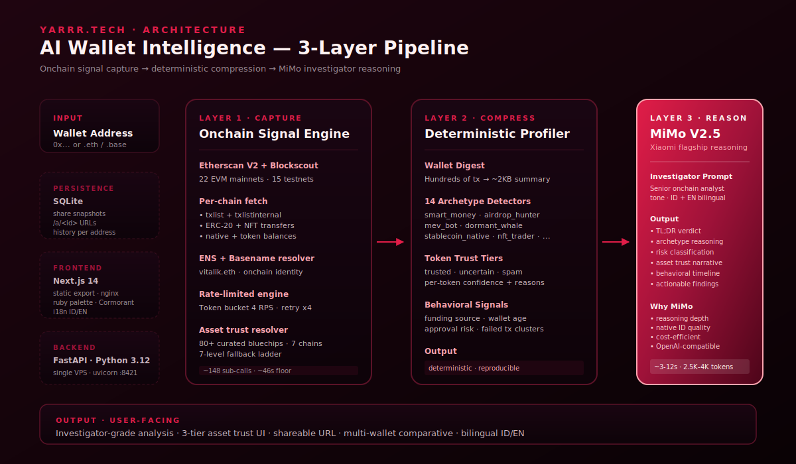

<div align="center">

# Yarrr.Tech

**AI Wallet Intelligence — read what a wallet *does*, not just what it holds.**

[](https://yarrr-node.com)
[](https://mimo.xiaomi.com/)
[](#coverage)
[](LICENSE)

[Live demo](https://yarrr-node.com) · [Sample analysis](https://yarrr-node.com/a/o7fwi2t5) · [Case study](docs/MIMO_CASE_STUDY.md) · [Architecture](docs/architecture.svg)

</div>

---

## What it does

Paste a wallet address. Yarrr.Tech compresses **hundreds of transactions across 37 EVM networks** into a single investigator-grade report — **what the wallet actually does**: airdrop hunter, smart money, dormant whale, NFT trader, MEV bot, stablecoin native, or something more interesting.

Not a portfolio tracker. Not a block explorer. A **reasoning layer** on top of onchain data that tells you the *story* behind a wallet.

```
0xd8dA6BF26964aF9D7eEd9e03E53415D37aA96045

→ vitalik.eth · multi_chain_native (1.0 confidence) · 4231 days old
→ Active across Ethereum, Arbitrum, Optimism, Base, Polygon
→ 23 spam NFT drops detected · 0 trusted holdings remaining onchain
→ Behavioral pattern: heavy receive · long-tail airdrop magnet · negligible recent outflow
```

## Why this exists

Block explorers dump raw transactions. Portfolio trackers chase prices. Neither tells you whether a wallet is a smart-money player worth copying, an airdrop farm worth ignoring, or a sybil cluster worth flagging.

Yarrr.Tech treats wallet analysis as **investigative reasoning**, not data display. Behavioral signals get extracted deterministically. A reasoning model interprets them in plain language, with caveats, with confidence — like a senior onchain analyst would.

## Architecture — 3-Layer Pipeline



### Layer 1 — Onchain Signal Engine (`backend/chain.py`, `backend/contract_names.py`)

- **Multi-chain fetch** across 22 mainnets + 15 testnets via Etherscan V2 (single key, 37 chain IDs) with Blockscout fallback
- **Per-chain signals**: `txlist` + `txlistinternal` + ERC-20 transfers + NFT transfers + native balance
- **Token + NFT enrichment** — symbol, name, contract verification, source code lookup
- **ENS + Basename resolver** — onchain identity in one API call
- **Token bucket rate limiter** (4 RPS sustained, exponential backoff retry x4) — respects Etherscan's free-tier 5 RPS hard cap
- **Asset trust resolver** (`backend/asset_trust.py`) — 80+ curated bluechip contracts across 7 mainnets, 7-level fallback ladder

### Layer 2 — Deterministic Profiler (`backend/profiler.py`, `backend/archetypes.py`)

- **Wallet digest** — hundreds of transactions compressed to ~2 KB structured summary
- **14 archetype detectors**: `smart_money`, `airdrop_hunter`, `mev_bot`, `dormant_whale`, `stablecoin_native`, `nft_trader`, `multi_chain_native`, `bridge_user`, `spam_exposed`, `approval_risk`, `high_revert_user`, `lst_holder`, `lp_provider`, `dormant_recovery`
- **Asset trust tiers** — every token classified `trusted` / `uncertain` / `spam` with confidence score (0-100) + human-readable reasons
- **Behavioral signals** — funding source heuristic, wallet age, approval risk, failed-tx clustering, multi-chain native detection
- **Output is reproducible** — same inputs always produce the same digest. No model variance leaks into the data layer.

### Layer 3 — MiMo Investigator Reasoning (`backend/intel.py`)

This is where Xiaomi MiMo V2.5 does the work that pattern matching can't.

- **Senior-analyst system prompt** — structured output: TL;DR → archetype interpretation → risk classification → asset trust narrative → behavioral timeline → actionable findings
- **Bilingual native** — Indonesian + English with technical jargon preserved (smart money, swap, bridge, MEV stay English even in ID locale)
- **Investigator tone** — never quotes raw numbers without context. Unverified tokens get phrasing like *"sellable market value cannot be confirmed"*, not blind dollar figures.
- **Latency**: 3-12s typical · 2.5K-4K output tokens · `max_tokens=4000` to stay above MiMo's reasoning-token budget threshold

## Why MiMo

After running the same digest through Claude Opus 4.6, GPT-5.5, and MiMo V2.5, MiMo earned the production slot for four reasons:

1. **Reasoning depth on structured numerical data** — archetype interpretation, asset trust narrative, and timeline analysis benefit from MiMo's reasoning-first design. The model produces fewer hedging filler phrases and more direct verdicts.
2. **Native Indonesian quality** — Yarrr.Tech ships ID + EN. MiMo's Indonesian output reads natural, doesn't fall into translation-ese, and respects the convention of keeping technical jargon English.
3. **Cost efficiency** — for a multi-paragraph investigator report (typical ~3K output tokens), MiMo runs comfortably within budget where premium frontier models would force us to gate the feature.
4. **OpenAI-compatible API** — drop-in via `https://api.xiaomimimo.com/v1`. Migrating from a previous provider took less than an hour.

One pitfall worth flagging for other MiMo builders: **reasoning tokens consume the `max_tokens` budget BEFORE content**. Set `max_tokens >= 1500`, ideally 4000 for analyst-style reports, or `response.content` returns empty while `completion_tokens` shows fully spent. Documented in our case study.

## Sample output

> ## TL;DR
> Wallet `0x9e2e25a...` is a **shallow-depth multi-chain explorer** with two real mainnet transactions and minor testnet activity. Not smart money. Not an airdrop farm. Likely a developer test wallet.
>
> ## Asset trust & holdings interpretation
> - **Tidak ada token terverifikasi yang layak jual** — trusted holdings = 0. Saldo native Ethereum nol.
> - DAI di Sepolia (~30.0K) adalah token faucet testnet — tidak memiliki nilai ekonomi dunia nyata.
> - RAIN di Arbitrum (~3.00) adalah token terverifikasi — nilai jual tidak dapat dikonfirmasi karena tidak ada data kedalaman pasar.
> - **12 token spam diterima** — mayoritas berisi URL phishing. Dompet ini dibombardir oleh spam airdrop; jangan approve kontrak apa pun yang berasal dari token-token ini.
>
> ## Risk classification
> Low active risk. Approval surface is minimal. The primary exposure is passive — phishing-style spam tokens accumulating in transfer history. No action required as long as the user does not interact with them.

Reproduce this on the live site, or via:

```bash
curl -sX POST https://yarrr-node.com/api/analyze \
  -H 'Content-Type: application/json' \
  -d '{"address":"0x9e2e25a223dafe308830f0327fbbef3a543bcc71","lang":"id"}'
```

## Coverage

**Mainnets (22)** — Ethereum, Arbitrum, Optimism, Base, Polygon, BSC, Avalanche, Linea, Scroll, Mantle, Blast, zkSync Era, Gnosis, Celo, Fantom, Moonbeam, Polygon zkEVM, Mode, Manta, Taiko, Berachain, Sonic

**Testnets (15)** — Sepolia, Holesky, Base Sepolia, Arbitrum Sepolia, Optimism Sepolia, Linea Sepolia, Blast Sepolia, BSC Testnet, Polygon Amoy, Mantle Sepolia, Scroll Sepolia, Avalanche Fuji, Berachain Bartio, Monad Testnet, Sonic Blaze

**Curated bluechip registry** — 80+ contracts across Ethereum, Arbitrum, Base, Optimism, Polygon, BSC, Avalanche (USDC, USDT, DAI, WETH, stETH, wstETH, rETH, cbETH, LINK, UNI, AAVE, CRV, COMP, SUSHI, BAL, GRT, 1INCH, YFI per chain).

## Stack

- **Backend** — Python 3.12 · FastAPI · uvicorn · SQLite for share snapshots · `httpx` for async fetch
- **Frontend** — Next.js 14 (static export) · Tailwind CSS · `next/font` Cormorant Garamond + Inter · ruby/wine palette
- **Reasoning** — Xiaomi MiMo V2.5 (`mimo-v2.5` flagship reasoning model) via `https://api.xiaomimimo.com/v1`
- **Infra** — Single VPS · Ubuntu 24.04 · nginx + LE TLS · systemd-managed `yarrr-intel.service`
- **Observability** — partial-chain flag in API responses · honest caveats for receive-only wallets

## Run locally

```bash
git clone https://github.com/AirdropLaura/yarrr-intel
cd yarrr-intel

# Backend
cp .env.example .env  # fill ETHERSCAN_API_KEY, MIMO_API_KEY
pip install -r requirements.txt
uvicorn backend.app:app --reload --port 8421

# Frontend
cd frontend
pnpm install
pnpm dev  # http://localhost:3000
```

API endpoints:

| Method | Path | Purpose |
|---|---|---|
| POST | `/api/analyze` | Single-wallet investigator report |
| POST | `/api/analyze/multi` | Multi-wallet (up to 10) comparative analysis |
| POST | `/api/share` | Persist snapshot, return shareable `/a/<id>` URL |
| GET | `/api/share/{sid}` | Fetch persisted snapshot |
| GET | `/api/history/{address}` | Recent analyses for an address |
| GET | `/api/health` | Service health |

## Documentation

- [PRODUCT.md](PRODUCT.md) — north star, phased roadmap
- [docs/MIMO_CASE_STUDY.md](docs/MIMO_CASE_STUDY.md) — why MiMo, latency benchmarks, prompt budget engineering
- [docs/architecture.svg](docs/architecture.svg) — full pipeline diagram

## License

MIT — see [LICENSE](LICENSE).

---

<div align="center">
<sub>Built with care by <a href="https://t.me/yarrr23"><b>Bastiar</b></a> · Reasoning by <a href="https://mimo.xiaomi.com/">Xiaomi MiMo V2.5</a></sub>
</div>
